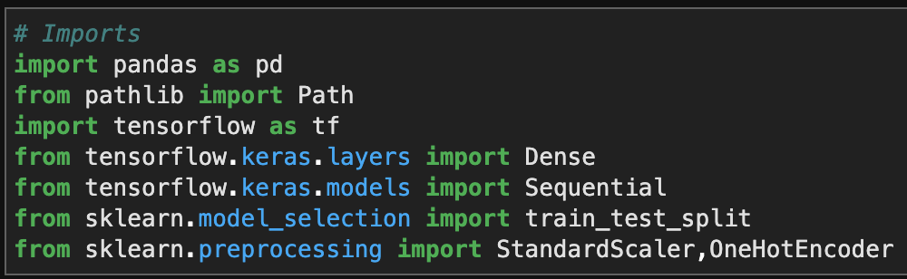
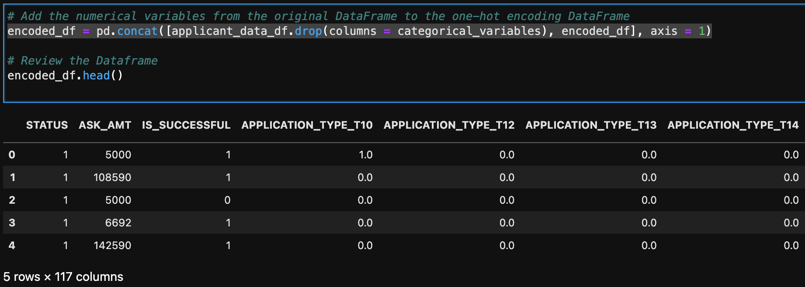
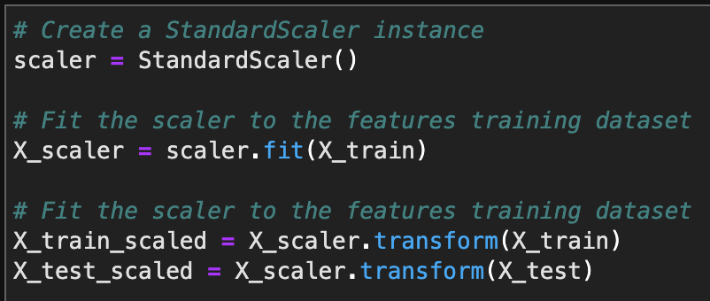
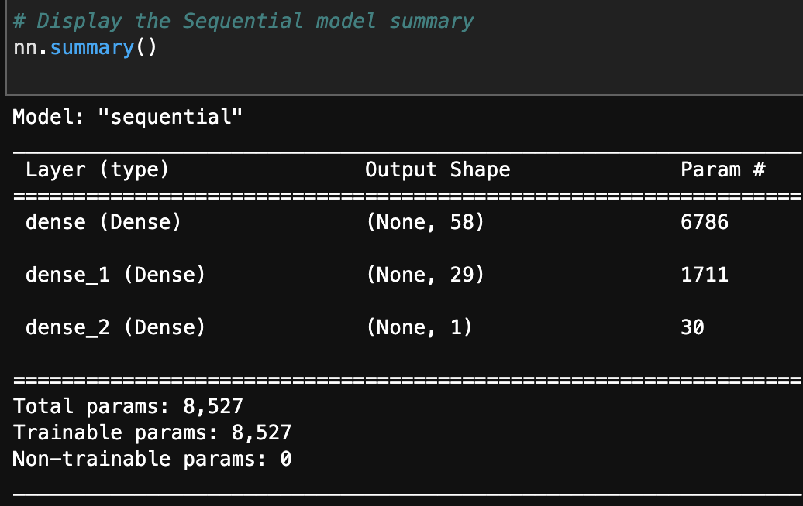
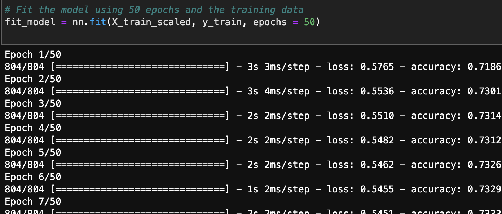
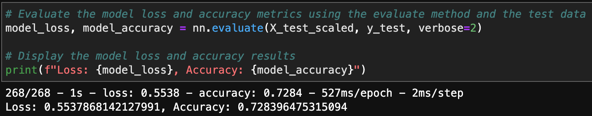
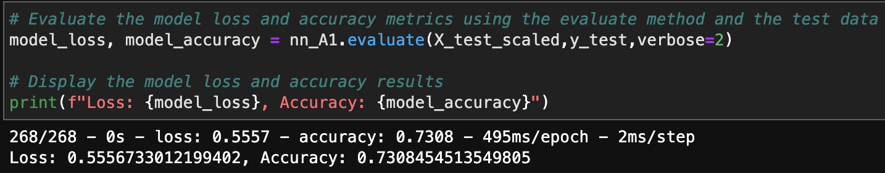
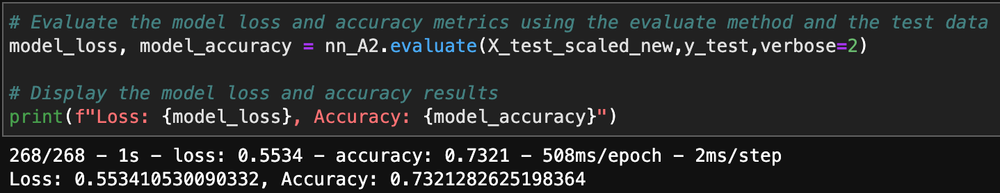

# DeepLearning_NeuralNetwork_model
>A binary classifier model is created for a venture capital firm to predict whether a funding applicant / startup will become a successful business.


Analysis includes:
    
* Prepare the data for use on a neural network model.

* Compile and evaluate a binary classification model using a neural network.

* Optimize the neural network model.
---

## Technologies
This project leverages python 3.7 with the following packages:

* [pandas](https://pandas.pydata.org/docs/getting_started/overview.html) - To read, calculate, analysis, visualize data

* [pathlib](https://docs.python.org/3/library/pathlib.html) - For providing paths of files and directories

* [tensorflow](https://www.tensorflow.org) - Create neural network model

* [sklearn](https://scikit-learn.org/stable/) - Predictive data analysis
---

## Installation Guide

Before running the Jupyter notebook file, first, install the following dependencies in Terminal or Bash under the `dev` environment.

```python
  pip install pandas
  pip install pathlib
  pip install -U scikit-learn
  pip install --upgrade tensorflow
```

---

## General Information
It is necessary to import all libraries and dependencies.


-- After dropping irrelevant columns from the DataFrame, use OneHotEncoder to transform object type of data into categorical data.

```python
categorical_variables = list(applicant_data_df.dtypes[applicant_data_df.dtypes == 'object'].index)

enc = OneHotEncoder(sparse=False)

encoded_data = enc.fit_transform(applicant_data_df[categorical_variables])

encoded_df = pd.DataFrame(encoded_data, columns = enc.get_feature_names(categorical_variables))
```
-- Combine encoded categorical data with integer type data from the original DataFrame.



-- Create the features(X) and target (y) datasets. And split the features and target sets into training and testing datasets.

```python
y = encoded_df['IS_SUCCESSFUL']
X = encoded_df.drop(columns = ['IS_SUCCESSFUL'])

X_train, X_test, y_train, y_test = train_test_split(X,y,random_state=1)
```

-- Use scikit-learn (StandardScaler) method to scale the featured data.



-- Compile and evaluate the binary classification model using a neural network. 

>Define all layers and number neurons on each layer
 ```python
number_input_features = len(X_train.loc[0])

number_output_neurons = 1

hidden_nodes_layer1 =  (number_input_features + number_output_neurons)// 2

hidden_nodes_layer2 =  (hidden_nodes_layer1 + number_output_neurons) //2
 ```
>Create the Sequential model instance and add all layers to the model with binary classification related activation function - 'Relu'

```python
nn = Sequential()

nn.add(Dense(units = hidden_nodes_layer1, input_dim = number_input_features, activation = 'relu'))

nn.add(Dense(units = hidden_nodes_layer2, activation = 'relu'))

nn.add(Dense(units = number_output_neurons, activation = 'sigmoid'))
```

>Generate the Sequential model summary



>Compile the model with 'binary_crossentropy' loss function, 'adam' as optimizer, and 'accuracy' for metrics 

```python
nn.compile(loss='binary_crossentropy', optimizer = 'adam', metrics = ['accuracy'])
```

>Fit the Sequential model with 50 epochs



>Evaluate the model using the test data to determine the model's loss and accuracy



-- Optimize the neural network model

* Alternative Model 1: increase hidden nodes on layer 1 and layer 2. Resulting a 0.2% accuracy increase from the original model.
```python
hidden_nodes_layer1_A1 = 80
hidden_nodes_layer2_A1 =  50
```


* Alternative Model 2: Resulting an additional 0.2% increase from the Alternative Model 1 by changing the following conditions:

    * Drop 'USE_CASE' column
    * Add the third hidden layer
    * Change epochs to 20



-- All three models were saved as HDF5 files under the Resources folder.

In conclusion, Neural Network deep learning model were used in this project to analyze and predict whether a startup will be a successful business in the furutre. Leveraging OneHotEncoder and StandardScaler functions, object and unbalanced data were transformed into model ready dataset to ensure the quality of analysis. By altering the number of input features, hidden layers, neurons on each hidden layers, and epochs, alternative models show accuracy improvement.

---

## Contributors

UC Berkeley Extension

Brought you by **Yanjun Lin Andrie**

* yanjun.lin.andrie@gmail.com

* https://www.linkedin.com/in/yanjun-linked

---

## License

MIT
